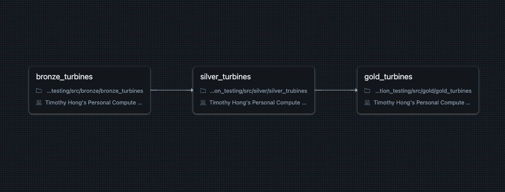
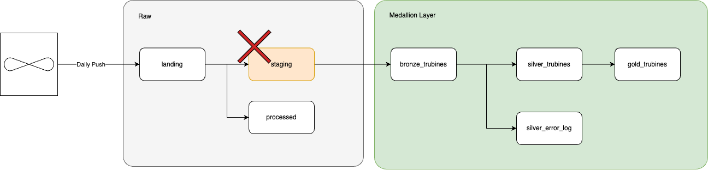

# Project Overview

The solution uses Databricks with Unity Catalog for storage management, organising data into Raw and Medallion layers. The pipeline orchestration is triggered by file arrivals, processing data through Bronze, Silver, and Gold layers for cleaning, validation, and aggregation. Key features include a merge operation for efficient updates, a Python-based implementation, and daily data ingestion with validation for wind turbine data. 

---

## Solution Design

### Platform
- **Databricks**

### Storage
- **Unity Catalog**: (Azure Storage Account)  
  The storage is hosted in a dedicated Azure Storage Account Container using the Databricks Azure Access Connector.

  - **Storage Layers**:
    - **Raw Layer**: Utilised to store raw data.  
      **Folder structure:**
      ```
      raw/
        landing/
        processed/
      ```
    - **Medallion Layer**: External location-managed tables stored in each dedicated folder.  
      **Folder structure:**
      ```
      bronze/
      silver/
      gold/
      ```

### Pipeline Orchestration
- **Databricks Workflow**:  
  Pipeline execution is triggered by a 'File Arrival' event.  



---

## Data Layers



### Raw Layer
- **Landing**:  
  The location where files are pushed from the source system.
- **Processed**:  
  Once files are ingested into the Bronze layer, they are copied to the `Processed` folder with a timestamp as the folder's name. This enables debugging and tracking file lineage.
- **Staging** (_not implemented_):  
  Although not implemented, a staging layer was considered. The decision to exclude it stems from using a merge operation directly on the Bronze layer. While some argue that the Bronze layer should strictly receive any ingested data from source data, my experience suggests this can lead to a "data swamp" when pipelines are accidentally triggered, improperly tested, or neglected.  
  A staging layer could be introduced depending on requirements.

---

### Medallion Architecture

#### Bronze Layer
- **`bronze_turbines`**:  
  This layer ingests data as-is but adds a `load_datetime` column using the same timestamp as the `Processed` folder in the Raw layer. This column facilitates debugging and Silver layer ingestion.

#### Silver Layer
- **`silver_turbines`**:  
  - Cleanses newly ingested data by removing rows containing null values, and conforming data types to requirements.  
- **`error_log`**:  
  - Captures and appends rows that fail validation or contain null values.

#### Gold Layer
- **`gold_turbines`**:  
  - Aggregates ingested data and identifies anomalies.

---

## Implementation Notes

### Merge Operation
- The `MERGE` operation is used to update all layers (except the `error_log` table) to ensure a future-proof process.  
- Cleaning and transformation are limited to newly ingested data in each run, ensuring an efficient and streamlined process.  
- Liquid clustering is applied to merge columns to optimize performance.

### Python Implementation
- A sequential Python approach was utilised, avoiding OOP approach to simplify testing and debugging within Databricks.


### Deployment
    deployment/
      schema_table_volume_builder.py
      schema.py
`schema_table_volume_builder.py` must run prior to the ingestion pipeline run.
This scripts set up and manages schemas, volumes, and tables in Databricks, applying predefined schemas, creating necessary structures, and optimising tables for bronze, silver, and gold layers.

### Utils
    utils/
      file_divider.py
      ingestion_helper.py
      transformation_helper.py
`file_divider` is a simple Panda script used to split the provided files.

`ingestion_helper` and `transformation_helper` scripts provide functions for processing and managing data in a Databricks environment. The `ingestion_helper` focuses on loading, merging, or inserting data into a Delta table using dynamic conditions. The `transformation_helper` includes functions for filtering null or invalid rows, casting a DataFrame to a specified schema, and extracting unprocessed data based on a join condition between two DataFrames.

---

## Assumptions
- **Manual Script Execution**: The `schema_table_volume_builder.py` script must be run manually before pipeline execution.
- **Daily Data Ingestion**: Data is ingested into the `Landing` folder daily.  
- **Wind Speed Validation**: Based on research, `wind_speed` values should range between 3 and 25. [Source: Endesa on Wind Turbines](https://www.endesa.com/en/the-e-face/energy-sector/wind-turbines-stopped-with-wind)
- **Wind Direction Validation**: The `wind_direction` field represents degrees, capped at 360.  
- **Anomaly Detection in Gold Layer**: For the `power_output`, instead of filtering anomalies in the Silver layer, they are identified in the Gold layer.  
- **Anomaly Detection Methodology**: Standard deviation is calculated over a daily time period, with anomalies flagged based on the average for each turbine. (This method may require adjustment based on additional business requirements or context.)  

---

## Potential Improvements
- **Code Testability**: Some Python functions could be refactored for improved testability.  
- **Validation**: Perfer Stronger validation processes to minimize cleaning requirements downstream.  
- **Unit Testing**: Comprehensive unit testing can enhance the robustness of the pipeline.  
- **Terraform**: Automating Databricks setup via Terraform would eliminate manual configuration challenges.
